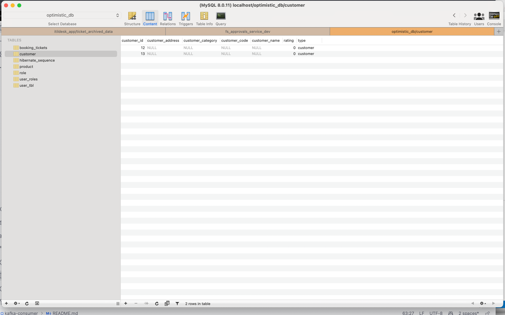
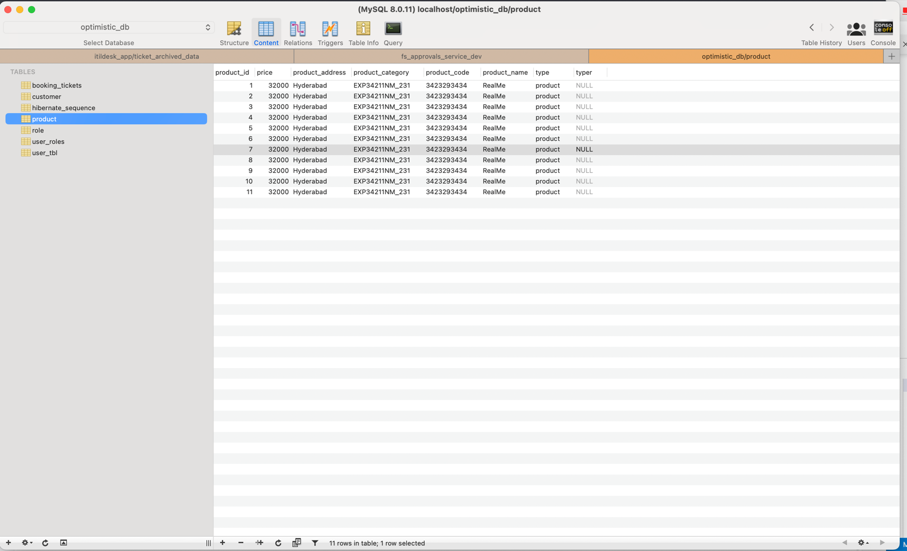
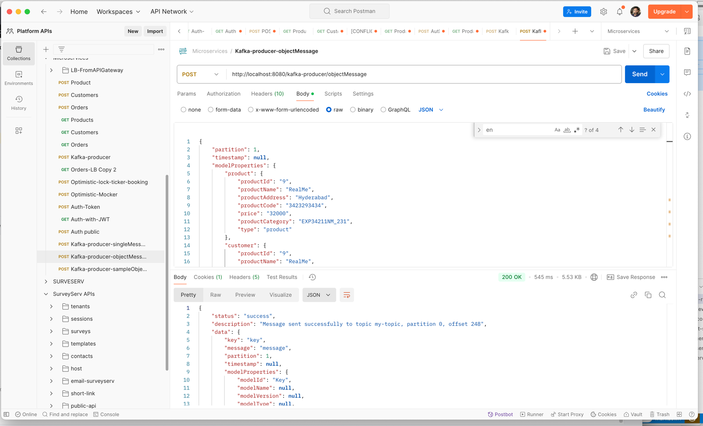

## Consumer Application Demo

This is a simple demo of a producer application that sends messages to a Kafka topic. The producer application is written in Python and uses the `confluent_kafka` library to interact with Kafka.


### Running the Consumer Application
- Make sure Kafka installed and running both zookeper and kafka services
- ```agsl
# How to Play with basic Kafka


- Install Kafka
  https://hevodata.com/learn/install-kafka-on-mac/ ==> https://kafka.apache.org/downloads

- Extract Kafka
  tar -xzf kafka_2.13-3.0.0.tgz

- Downloaded to
```
/Users/vevana/kafka/kafka_2.13-3.7.0
```

- Strat Zookeeper
```
./bin/zookeeper-server-start.sh config/zookeeper.properties
```

- Start Kafka server:
```
./bin/kafka-server-start.sh config/server.properties
```

- Create a topic:
```
./bin/kafka-topics.sh --create --bootstrap-server localhost:9092 --replication-factor 1 --partitions 1 --topic my-topic
```

- List Topics
```
./bin/kafka-topics.sh --list --bootstrap-server localhost:9092
```

- Console Producer:
```
./bin/kafka-console-producer.sh --bootstrap-server localhost:9092 --topic my-topic
```


- Console Consumer:
```
./bin/kafka-console-consumer.sh --bootstrap-server localhost:9092 --topic my-topic --from-beginning
```


RUN from SpringBoot App
--
cd kafka-consumer && mvn spring-boot:run

## Samples




 
