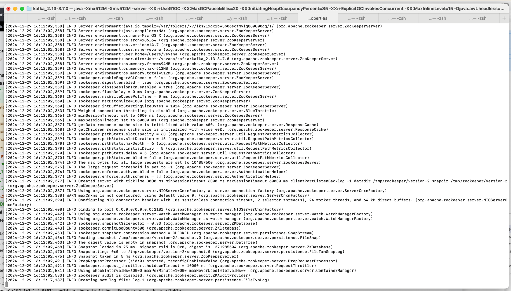
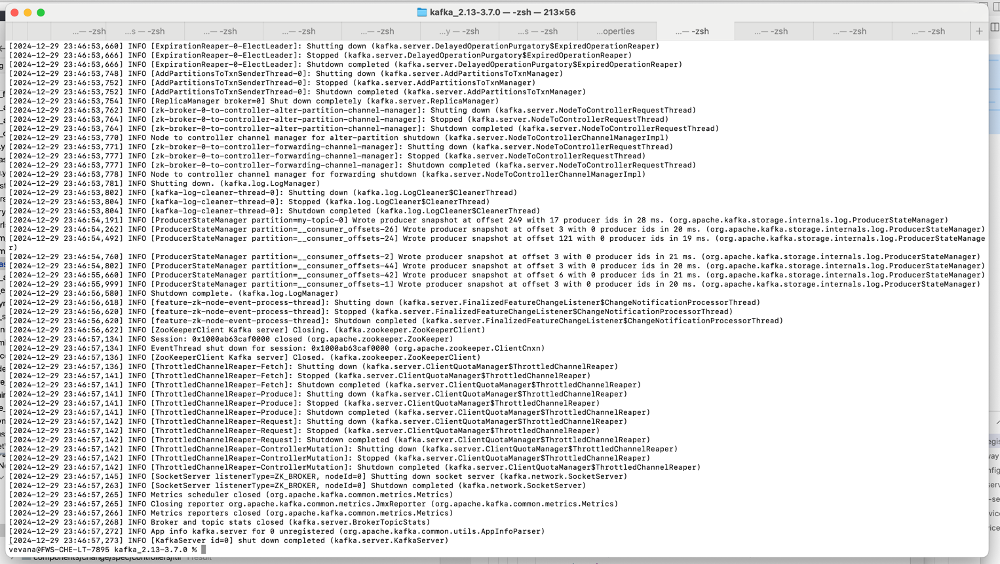
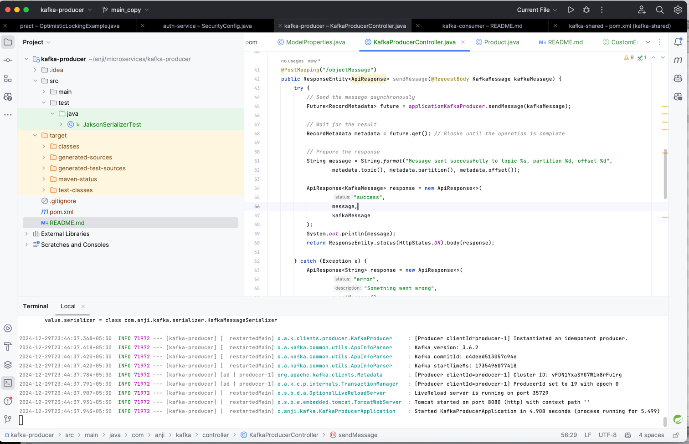
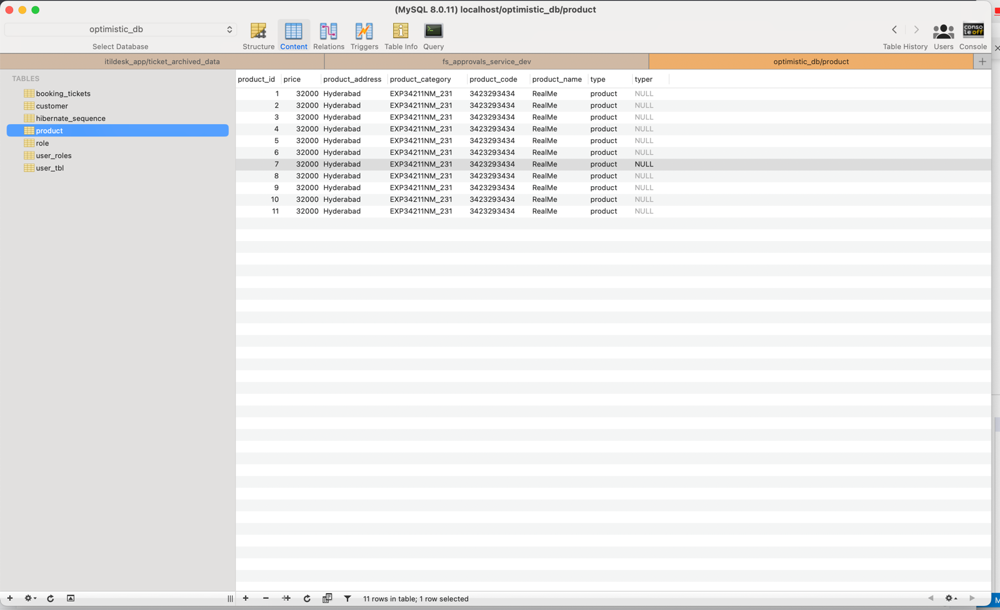
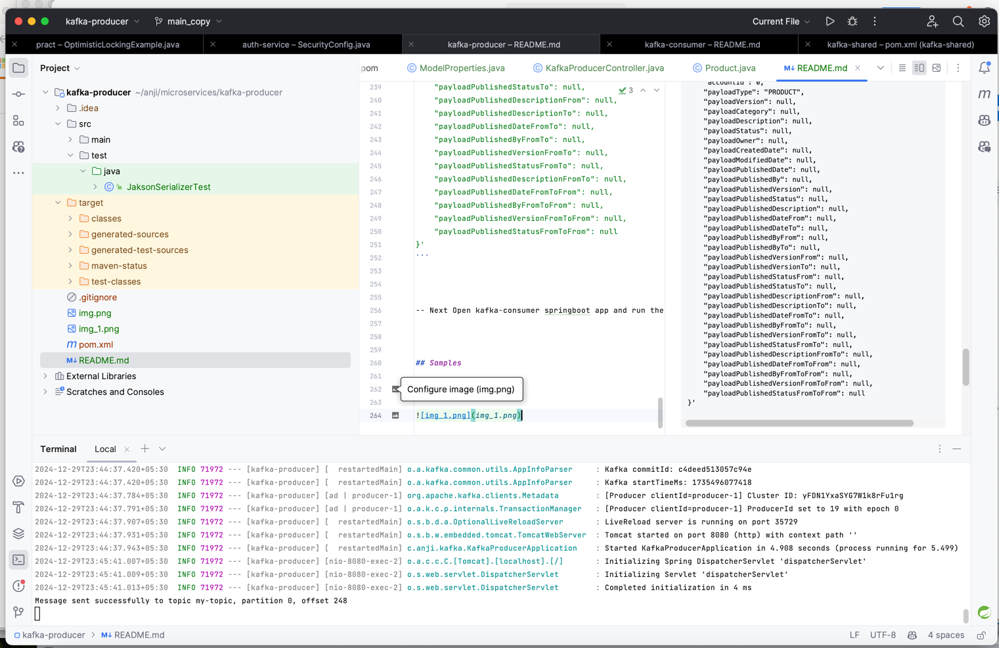
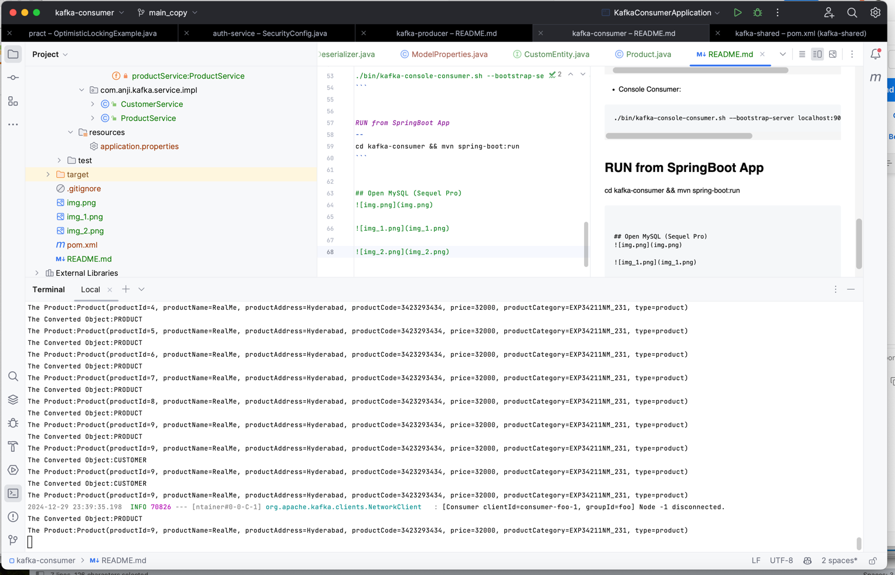

## Producer Application Demo

This is a simple demo of a producer application that sends messages to a Kafka topic. The producer application is written in Python and uses the `confluent_kafka` library to interact with Kafka.


### Running the Producer Application
- Make sure Kafka installed and running both zookeper and kafka services
- ```agsl
# How to Play with basic Kafka


- Install Kafka
  https://hevodata.com/learn/install-kafka-on-mac/ ==> https://kafka.apache.org/downloads

- Extract Kafka
  tar -xzf kafka_2.13-3.0.0.tgz

- Downloaded to
```
/Users/vevana/kafka/kafka_2.13-3.7.0
```

- Strat Zookeeper
```
./bin/zookeeper-server-start.sh config/zookeeper.properties
```

- Start Kafka server:
```
./bin/kafka-server-start.sh config/server.properties
```

- Create a topic:
```
./bin/kafka-topics.sh --create --bootstrap-server localhost:9092 --replication-factor 1 --partitions 1 --topic my-topic
```

- List Topics
```
./bin/kafka-topics.sh --list --bootstrap-server localhost:9092
```

- Console Producer:
```
./bin/kafka-console-producer.sh --bootstrap-server localhost:9092 --topic my-topic
```


- Console Consumer:
```
./bin/kafka-console-consumer.sh --bootstrap-server localhost:9092 --topic my-topic --from-beginning
```


RUN from SpringBoot App
--
cd kafka-demo && mvn spring-boot:run

Run
```
curl --location 'http://localhost:8080/push/' \
--header 'Content-Type: application/json' \
--data-raw '{
    "customerId": 11,
    "firstName": "Revi",
    "lastName": "Hyderabad",
    "email": "revi.e@hotmail.com"
}'
```


```

- make sure kafka-shared repo installed for common modules
- Install the required dependencies by running `mvn install`.
-  mvn spring-boot:run
- Run the producer application by running `mvn spring-boot:run`.


```curl
curl --location 'http://localhost:8080/kafka-producer/objectMessage' \
--header 'Content-Type: application/json' \
--header 'Cookie: JSESSIONID=3C65349D5878D1997AD7DFE65DC2275D' \
--data '{
    "partition": 1,
    "timestamp": null,
    "modelProperties": {
        "product": {
            "productId": "9",
            "productName": "RealMe",
            "productAddress": "Hyderabad",
            "productCode": "3423293434",
            "price": "32000",
            "productCategory": "EXP34211NM_231",
            "type": "product"
        },
        "customer": {
            "productId": "9",
            "productName": "RealMe",
            "productAddress": "Hyderabad",
            "productCode": "3423293434",
            "price": "32000",
            "productCategory": "EXP34211NM_231",

            "type": "customer"
        },
        "modelId": "Key",
        "modelName": null,
        "modelVersion": null,
        "modelType": null,
        "modelCategory": "aaa",
        "modelDescription": null,
        "modelStatus": null,
        "modelOwner": null,
        "modelCreatedDate": null,
        "modelModifiedDate": null,
        "modelPublishedDate": null,
        "modelPublishedBy": null,
        "modelPublishedVersion": null,
        "modelPublishedStatus": null,
        "modelPublishedDescription": null,
        "modelPublishedDateFrom": null,
        "modelPublishedDateTo": null,
        "modelPublishedByFrom": null,
        "modelPublishedByTo": null,
        "modelPublishedVersionFrom": null,
        "modelPublishedVersionTo": null,
        "modelPublishedStatusFrom": null,
        "modelPublishedStatusTo": null,
        "modelPublishedDescriptionFrom": null,
        "modelPublishedDescriptionTo": null,
        "modelPublishedDateFromTo": null,
        "modelPublishedByFromTo": null,
        "modelPublishedVersionFromTo": null,
        "modelPublishedStatusFromTo": null,
        "modelPublishedDescriptionFromTo": null,
        "modelPublishedDateFromToFrom": null,
        "modelPublishedByFromToFrom": null,
        "modelPublishedVersionFromToFrom": null,
        "modelPublishedStatusFromToFrom": null,
        "modelPublishedDescriptionFromToFrom": null,
        "modelPublishedDateFromToTo": null,
        "modelPublishedByFromToTo": null,
        "modelPublishedVersionFromToTo": null,
        "modelPublishedStatusFromToTo": null,
        
        "modelPublishedDescriptionFromToToFrom": null,
        "modelPublishedDateFromFromTo": null,
        "modelPublishedByFromFromTo": null,
        "model": null
    },
    "systemProperties": {
        "systemId": "SystemId",
        "systemName": null,
        "systemType": null,
        "systemVersion": null,
        "systemDescription": "SystemDescription",
        "systemLocation": null,
        "systemStatus": null,
        "systemOwner": null,
        "systemOwnerEmail": null,
        "systemOwnerPhone": null,
        "systemOwnerAddress": null,
        "systemOwnerCity": null,
        "systemOwnerState": null,
        "systemOwnerCountry": null,
        "systemOwnerZip": null,
        "systemOwnerFax": null,
        "systemOwnerWebsite": null,
        "systemOwnerOrganization": null,
        "systemOwnerDepartment": null,
        "systemOwnerRole": null,
        "systemOwnerTitle": null,
        "systemOwnerManager": null,
        "systemOwnerManagerEmail": null,
        "systemOwnerManagerPhone": null,
        "systemOwnerManagerAddress": null,
        "systemOwnerManagerCity": null,
        "systemOwnerManagerState": null,
        "systemOwnerManagerCountry": null,
        "systemOwnerManagerZip": null,
        "systemOwnerManagerFax": null,
        "systemOwnerManagerWebsite": null,
        "systemOwnerManagerOrganization": null,
        "systemOwnerManagerDepartment": null,
        "systemOwnerManagerRole": null,
        "systemOwnerManagerTitle": null,
        "systemOwnerManagerManager": null,
        "systemOwnerManagerManagerEmail": null,
        "systemOwnerManagerManagerPhone": null,
        "systemOwnerManagerManagerAddress": null,
        "systemOwnerManagerManagerCity": null,
        "systemOwnerManagerManagerState": null,
        "systemOwnerManagerManagerCountry": null,
        "systemOwnerManagerManagerZip": null,
        "systemOwnerManagerManagerFax": null,
        "systemOwnerManagerManagerWebsite": null,
        "systemOwnerManagerManagerOrganization": null,
        "systemOwnerManagerManagerDepartment": null,
        "systemOwnerManagerManagerRole": null,
        "systemOwnerManagerManagerTitle": null,
        "systemOwnerManagerManagerManager": null,
        "systemOwnerManagerManagerManagerEmail": null,
        "systemOwnerManagerManagerManagerPhone": null,
        "systemOwnerManagerManagerManagerAddress": null,
        "systemOwnerManagerManagerManagerCity": null,
        "systemOwnerManagerManagerManagerState": null,
        "systemOwnerManagerManagerManagerCountry": null,
        "systemOwnerManagerManagerManagerZip": null,
        "systemOwnerManagerManagerManagerFax": null,
        "systemOwnerManagerManagerManagerWebsite": null,
        "systemOwnerManagerManagerManagerOrganization": null,
        "systemOwnerManagerManagerManagerDepartment": null
    },
    "accountId": 0,
    "payloadType": "PRODUCT",
    "payloadVersion": null,
    "payloadCategory": null,
    "payloadDescription": null,
    "payloadStatus": null,
    "payloadOwner": null,
    "payloadCreatedDate": null,
    "payloadModifiedDate": null,
    "payloadPublishedDate": null,
    "payloadPublishedBy": null,
    "payloadPublishedVersion": null,
    "payloadPublishedStatus": null,
    "payloadPublishedDescription": null,
    "payloadPublishedDateFrom": null,
    "payloadPublishedDateTo": null,
    "payloadPublishedByFrom": null,
    "payloadPublishedByTo": null,
    "payloadPublishedVersionFrom": null,
    "payloadPublishedVersionTo": null,
    "payloadPublishedStatusFrom": null,
    "payloadPublishedStatusTo": null,
    "payloadPublishedDescriptionFrom": null,
    "payloadPublishedDescriptionTo": null,
    "payloadPublishedDateFromTo": null,
    "payloadPublishedByFromTo": null,
    "payloadPublishedVersionFromTo": null,
    "payloadPublishedStatusFromTo": null,
    "payloadPublishedDescriptionFromTo": null,
    "payloadPublishedDateFromToFrom": null,
    "payloadPublishedByFromToFrom": null,
    "payloadPublishedVersionFromToFrom": null,
    "payloadPublishedStatusFromToFrom": null
}'
```


-- Next Open kafka-consumer springboot app and run the application


## Samples

- Zookeper start


- kafka start


- postman curl commands






